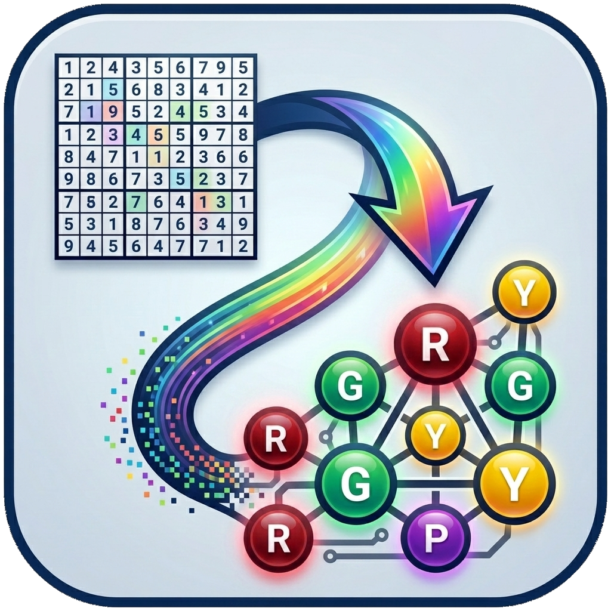
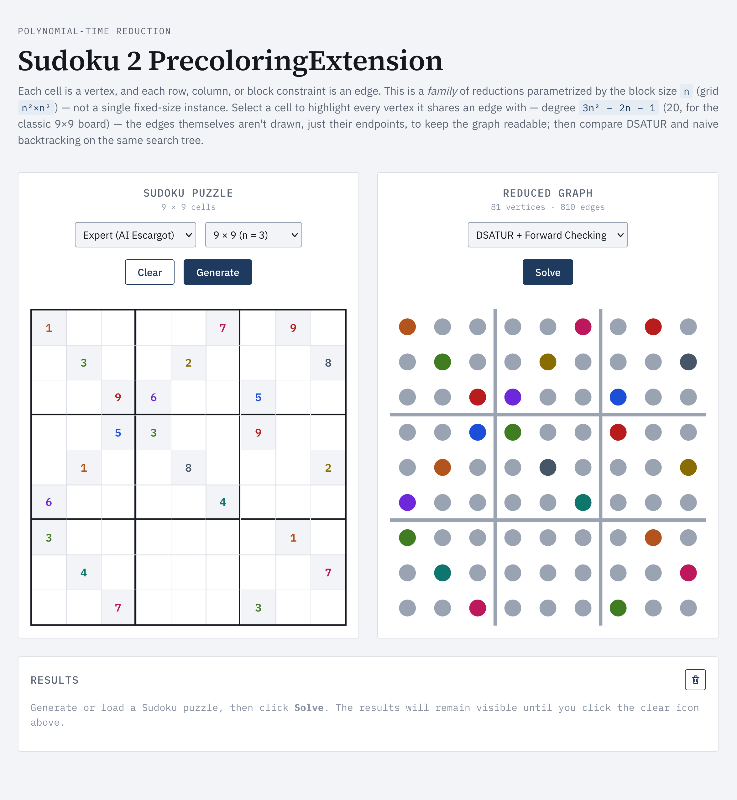
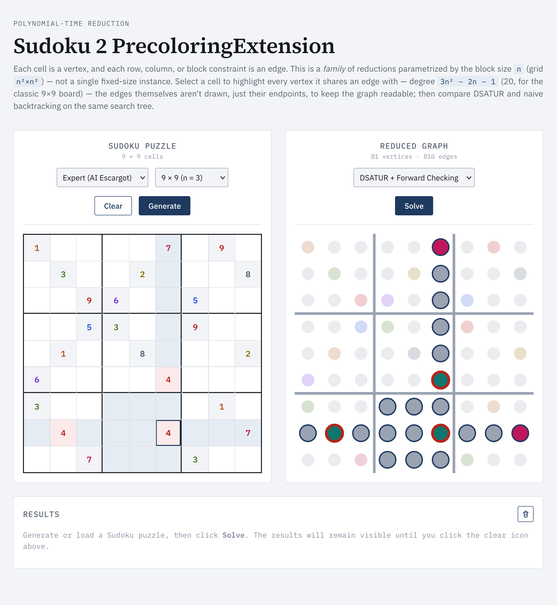
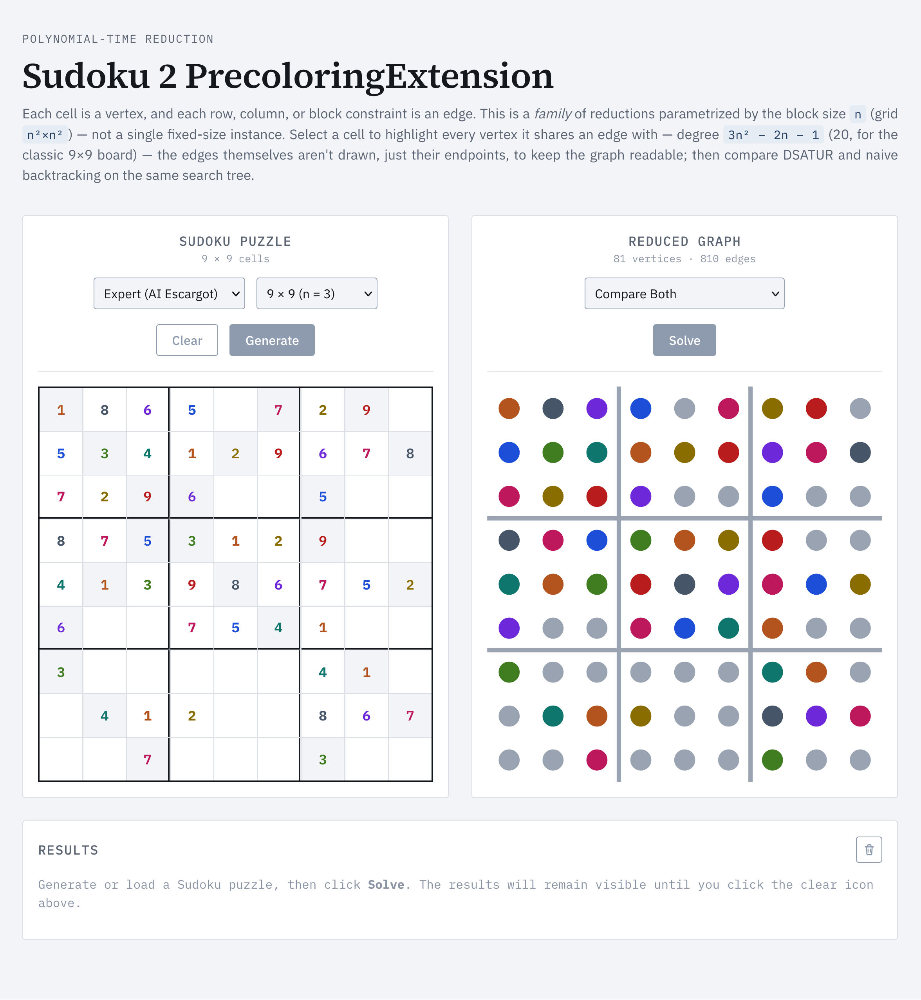
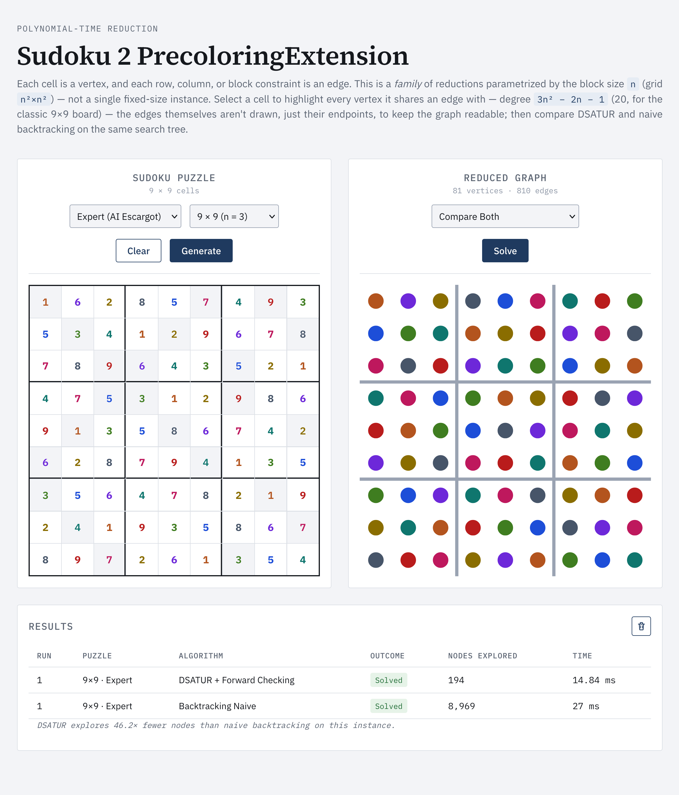

# Sudoku 2 PrecoloringExtension
Sudoku solved as a Pre-coloring Extension instance: a polynomial *family* of reductions (parametrized by block size `n`, selectable from 4×4 to 16×16), two backtracking algorithms side by side, and an interface that shows both representations — grid and graph — as the same object seen from two angles.

<p align="center"> 
    
</p>

## The reduction

This is not a single fixed-size construction: it's a family of polynomial-time transformations, one for every block size `n`, mapping a generalized Sudoku on an `n²×n²` grid to an instance of **Pre-coloring Extension** (a.k.a. list coloring) — a graph-coloring problem where part of the assignment is fixed in advance — which is the precise decision problem this app targets, not "plain" k-coloring. The app currently supports `n = 2, 3, 4` (boards 4×4, 9×9, 16×16); `n = 3` is the classic Sudoku.

For a given `n`:
- each cell `(r, c)` becomes a node → **n⁴ nodes**;
- two nodes are connected if their cells share a constraint (same row, same column, or same `n×n` block) → degree **3n² − 2n − 1** per node, **n⁴(3n² − 2n − 1)/2 edges**. Concretely: n=2 → 16 nodes, degree 7, 56 edges; n=3 → 81 nodes, degree 20, 810 edges; n=4 → 256 nodes, degree 39, 4992 edges.
- cells already filled in become a fixed pre-coloring.
- the instance-to-instance map is computable in time polynomial in `n` (building the adjacency lists and edge list costs `Θ(n⁶)`: `n⁴` cells, `O(n²)` work each for the row/column/block neighbors — and this is tight, not just an upper bound, since the graph itself has `Θ(n⁶)` edges, so no algorithm that writes them all out can do better) — which is the actual sense in which this is "a polynomial reduction": a statement about an infinite family of instances of growing size, not about one fixed 9×9 board (see *"Why a family, not one instance"* below).

An `n²`-coloring of the graph that respects the pre-coloring corresponds exactly to a solution of the Sudoku instance: every row, column, and block is an `n²`-clique, so a proper coloring drawing from exactly `n²` available colors is forced to use all of them on each clique — a genuine bijection between colorings and Sudoku solutions, not just an "if" direction.

### What this proves, and what it doesn't

The direction implemented here is **Sudoku ≤ₚ Pre-coloring Extension**: every Sudoku instance maps to a coloring instance, so any algorithm that solves coloring also solves Sudoku — which is exactly how this app uses DSATUR. That's the right direction for the practical goal of *solving* Sudoku via a graph-coloring algorithm.

It does **not**, by itself, establish that Sudoku is NP-complete. NP-hardness of generalized Sudoku is Yato & Seta's result (2003), proved with a reduction in the *opposite* direction — from Latin Square Completion (a known NP-complete problem) *into* Sudoku — combined with the easy observation that Sudoku ∈ NP (a filled grid is checkable in polynomial time). "Sudoku is NP-complete" and "k-coloring is NP-complete for k ≥ 3" are both true and worth citing as context, but this construction doesn't connect them in the hardness direction — only in the "solve via" direction. The natural follow-up question — *what would the converse reduction look like?* — would require encoding an arbitrary 3-colorable graph (or Latin Square Completion instance) as a Sudoku grid, a different and harder construction than the one implemented here.

A second, more technical point: this is closer to a **constructive (Levin-style) reduction** than a plain Karp reduction. A Karp reduction only needs to preserve the yes/no answer; this implementation also gives an explicit, efficiently computable map from a coloring back to a Sudoku grid (`coloring_to_grid`) and from a grid to a pre-coloring (`grid_to_precoloring`) — so a solution to one instance reconstructs a solution to the other, not just a verdict.

### Why a family, not one instance

A reduction is, by definition, a statement about an unbounded family of instances of growing size — that's what "polynomial in the input size" means. A single, fixed 9×9 board has constant size, so no statement about asymptotic complexity classes applies to "the one 9×9 Sudoku problem" in isolation. Generalizing the construction to an arbitrary block size `n` (here implemented for `n = 2, 3, 4`, selectable in the interface) makes that asymptotic argument concrete: `reduction.py`, `solver.py`, and `generator.py` are all written against a parameter `n`, not a hardcoded constant — the classic 9×9 case is simply `n = 3` in that family, on the same footing as 4×4 and 16×16. `n` is capped at 4 in this app purely for UI/runtime reasons (see below), not because the construction stops being polynomial beyond that.

One practical side-effect of generalizing to `n = 4`: with 16 colors, simple backtracking — even DSATUR with only direct-neighbor forward checking rather than full arc-consistency — degrades much faster than at `n = 3`. The generator deliberately removes the *same* fraction of cells for a given difficulty label regardless of `n` (so "hard" always means "66.7% of cells removed", whether the board is 9×9 or 16×16 — keeping difficulty labels comparable across block sizes instead of secretly making `n = 4` easier to dodge the slowdown); the solver instead adds a wall-clock guard (`MAX_SECONDS`, on top of the existing node-count guard `MAX_NODES`) to deal with the resulting slower searches. When either guard fires mid-search the result is flagged `guard_triggered` and shown as "incomplete" rather than "no solution" — an aborted search is not a proof that no solution exists.

## Two algorithms, same problem
 
Both algorithms operate on the *same* reduced graph (same adjacency, same fixed pre-coloring) — they differ only in node-ordering and look-ahead, so the comparison below is an apples-to-apples ablation of what DSATUR's heuristic actually buys you, not a comparison between two different representations of the puzzle:

- **Naive** — picks the first uncolored node in a fixed, arbitrary order (by node id), tries colors low to high, no look-ahead.
- **DSATUR + Forward Checking** (Brélaz, 1979) — at each step, colors the node with maximum saturation (MRV: fewer available colors means a tighter constraint, so it fails earlier), and propagates the constraint to direct neighbors immediately after each assignment.

Both algorithms here are full backtracking searches, with undo on failure — not the classic textbook DSATUR, which is a single-pass greedy heuristic with no backtracking and can fail to find a solution even when one exists. This implementation uses DSATUR's saturation criterion only to *order* which node to branch on next, inside a complete, sound backtracking search — hence the name "DSATUR + Forward Checking" rather than plain "DSATUR".

Both work for any block size `n` the app supports. Note this is *not* full arc-consistency (AC-3) — only direct neighbors are checked after each assignment — which is part of why `n = 4` (16 colors) can occasionally hit the search guards described above even though the underlying worst-case complexity argument (the problem is still NP-hard for the generalized, unbounded-size version) doesn't change with `n`. DSATUR still explores a search tree orders of magnitude smaller than naive backtracking in practice — the app makes this visible by comparing nodes explored by both algorithms on the same instance.

## Interface
 
- **Board size selector** (4×4 / 9×9 / 16×16, i.e. `n = 2, 3, 4`): rebuilds both the grid and the graph for the chosen block size and refetches the corresponding instance from `/graph?n=`.
- The Sudoku grid and the graph share the same `(r, c)` coordinates: selecting a cell draws its neighboring edges in the graph panel, live (their number depends on `n`: 7 at 4×4, 20 at 9×9, 39 at 16×16).
- Puzzle generation by difficulty (easy / medium / hard) or fixed seed, plus an "expert" preset (AI Escargot) — only available at `n = 3`, since it's a specific famous 9×9 instance.
- Step-by-step animated solving, with a run history that accumulates (useful for comparing DSATUR vs naive across several instances) — only cleared by "Clear". A run that hit a search guard is shown as "Guard (incomplete)", distinct from a genuine "No solution".


## Instruction to run the project
1. Install all the requirements in the file by executing:
    ```
    pip install -r requirements.txt
    ```
2. Run the main server by executing:
    ```
    python app.py
    ```
3. Then go to: http://localhost:5050 (or any other port selected in the app.py file)

## Screenshots
<div align="center">
    <div>
        <h5>Creating the Sudoku Grid</h5>
    </div>
    
</div>

<div align="center">
    <div>
        <h5>Incorrect input</h5>
    </div>
    
</div>

<div align="center">
    <div>
        <h5>During resolution</h5>
    </div>
    
</div>

<div align="center">
    <div>
        <h5>Reduction completed</h5>
    </div>
    
</div>

<div align="center">
    <div>
        <h5>Example with the 4x4 grid</h5>
    </div>
    
</div>

## References
- [New methods to color the vertices of a graph](https://dl.acm.org/doi/10.1145/359094.359101) - Daniel Brélaz
- [Complexity and Completeness of Finding Another Solution and Its Application to Puzzles](https://academic.timwylie.com/17CSCI4341/sudoku.pdf) - Takayuki Yato, Takahiro Seta

## Contribution
If you'd like to contribute, please follow these steps:
- Fork the repository;
- Create a new branch (```git checkout -b feature/YourFeatureName```);
- Commit your changes (```git commit -m 'Add some feature'```);
- Push to the branch (```git push origin feature/YourFeatureName```);
- Open a pull request.

## License
This project is licensed under the MIT License. See the LICENSE file for details.
